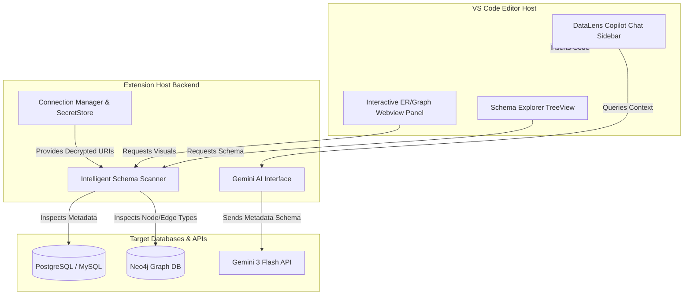

# 🔌 DataLens AI: VS Code Extension Design & Implementation Guide

This directory documents the blueprint, architecture, and step-by-step implementation guide for porting the **DataLens AI** web application into a native **VS Code Extension**. 

By integrating DataLens AI directly into the IDE, developers can visualize schemas, inspect graph relationships, and chat with their database metadata without leaving their active coding workspace.

---

## 🌟 The Vision

Bringing database intelligence directly to the developer's fingertips:
- **Zero Context-Switching:** Visualize ER diagrams and graph databases inline.
- **Secure Credentials:** Store connection strings securely in VS Code's built-in `SecretStorage`.
- **AI-Powered Code Gen:** Chat with schema metadata and insert generated SQL or Cypher directly into the active editor.

---

## 🛠 Feature Mapping: Web App to VS Code Extension

Here is how the core functionalities of the DataLens AI web app map to VS Code's native user interface paradigms:

| Web Feature | VS Code Extension Counterpart | Implementation Technology |
|:---|:---|:---|
| **Connection Settings** | VS Code Settings (`settings.json`) + Command Palette | VS Code Configuration API & `SecretStorage` |
| **Schema Explorer** | Primary Sidebar Tree View | `vscode.TreeDataProvider` |
| **Interactive ER & Graphs** | Main Editor Webview / Custom Editor | `vscode.WebviewPanel` + React + D3.js/Cytoscape.js |
| **AI Schema Chat** | Chat View Panel / Copilot Chat participant | VS Code Chat API (`vscode.lm`) / Custom Webview Chat |
| **Schema Analytics** | Webview Dashboard Tab | HTML/CSS + Tailwind (in Webview) + Chart.js |

---

## 📐 Architecture Diagram

Below is the conceptual architecture of the DataLens AI VS Code Extension:



---

## 📂 Proposed Project Structure

To build this extension, the workspace layout is structured as follows:

```text
vscode-extension/
├── .vscode/
│   ├── launch.json          # Debug configurations for Extension Host
│   └── tasks.json           # Watch/Build scripts
├── src/
│   ├── extension.ts         # Main activation and command registrations
│   ├── connectionManager.ts # SecretStorage handling for DB URIs
│   ├── schemaScanner.ts     # Metadata extraction logic (PostgreSQL/MySQL/Neo4j)
│   ├── views/
│   │   ├── explorerView.ts  # TreeDataProvider for sidebar schema list
│   │   └── diagramWebview.ts# WebView controller to render ER diagrams/Graphs
│   └── ai/
│       └── copilotProvider.ts# VS Code Chat View or LLM client handler
├── media/                   # Icons, stylesheets, and React bundle for Webview
│   ├── er-diagram.css
│   └── main.js
├── package.json             # Manifest declaring commands, views, and settings
├── tsconfig.json            # TypeScript configuration
└── webpack.config.js        # Bundles extension and webview components
```

---

## 🚀 Step-by-Step Implementation Plan

### Phase 1: Setup & Activation
1. **Initialize Project:**
   Bootstrap the Extension using the Yeoman Generator:
   ```bash
   npx -y yo generator-code --quick --typescript --git --install-dependencies
   ```
2. **Define Contributions in `package.json`:**
   Add custom activation events, sidebar views, settings, and commands:
   ```json
   "activationEvents": [
     "onView:datalens-explorer",
     "onCommand:datalens.visualizeSchema"
   ],
   "contributes": {
     "viewsContainers": {
       "activitybar": [
         {
           "id": "datalens-sidebar",
           "title": "DataLens AI",
           "icon": "media/icon.svg"
         }
       ]
     },
     "views": {
       "datalens-sidebar": [
         {
           "id": "datalens-explorer",
           "name": "Database Schema Explorer"
         }
       ]
     },
     "commands": [
       {
         "command": "datalens.connectDb",
         "title": "DataLens: Connect to Database"
       },
       {
         "command": "datalens.visualizeSchema",
         "title": "DataLens: Show Interactive ER Diagram"
       }
     ]
   }
   ```

### Phase 2: Secure Database Connection
1. **Secure Storage:** Store database connection URIs using VS Code's `context.secrets` (`SecretStorage`) to prevent credentials from leaking in plain-text `settings.json`.
2. **Database Driver Integration:** Reuse the existing Drizzle/Driver logic from the web application backend to fetch tables, columns, constraints, indices, and neo4j nodes/edges directly inside Node.js environment.

### Phase 3: Sidebar Tree View (Schema Explorer)
- Implement `vscode.TreeDataProvider` to build a drill-down schema explorer in the sidebar:
  - 📁 **Database Name**
    - 📁 **Tables** (e.g., `customers`, `orders`)
      - 🔑 `customer_id` (PK, text)
      - 🔗 `email` (Unique, text)
    - 📁 **Relationships** (e.g., `customers ── orders`)

### Phase 4: Webview-Based Visualizer (ER & Graph Visualizations)
- Create a `WebviewPanel` that loads a bundled React/HTML application.
- Use **D3.js** or **Cytoscape.js** to draw the interactive ER diagram and Neo4j graph nodes.
- Implement post-message communication to pass scanned schema data from the extension host into the Webview:
  ```typescript
  // In extension host
  webviewPanel.webview.postMessage({ command: 'loadSchema', data: schemaMetadata });
  ```

### Phase 5: Inline AI Schema Chat (DataLens Copilot)
- Build an AI sidebar panel or integrate with the **VS Code Chat API** (Copilot Chat extension point).
- Provide the Gemini LLM with the context of the scanned database schema (no rows data, only structural DDL/JSON).
- Add a "Write to Document" or "Run in Editor" button to let users inject generated SQL or Cypher statements directly into their open files:
  ```typescript
  vscode.window.activeTextEditor?.edit(editBuilder => {
      editBuilder.insert(position, generatedQuery);
  });
  ```

---

## 🔒 Security Best Practices for the Extension

- **No Data Leakage:** Send only the schema metadata (table structures, types, labels) to the LLM (Gemini 3 Flash). Do not transmit actual table records or customer data.
- **Credential Safety:** Use `context.secrets.store()` rather than VS Code global state or plain configuration settings to save user connection strings.
- **Local Sandbox Execution:** Run the connection scans locally within the extension backend process instead of sending connection URIs to third-party endpoints.
